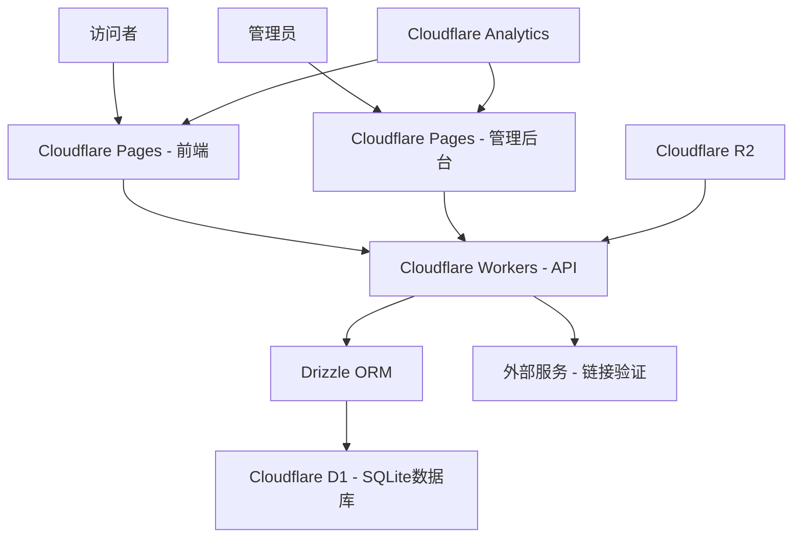
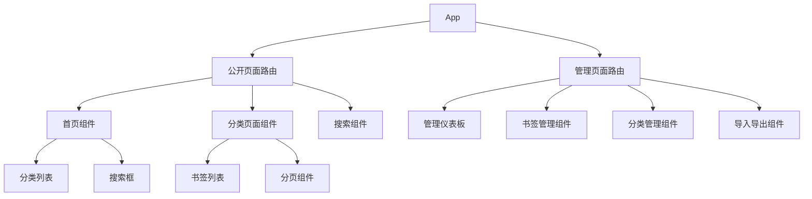
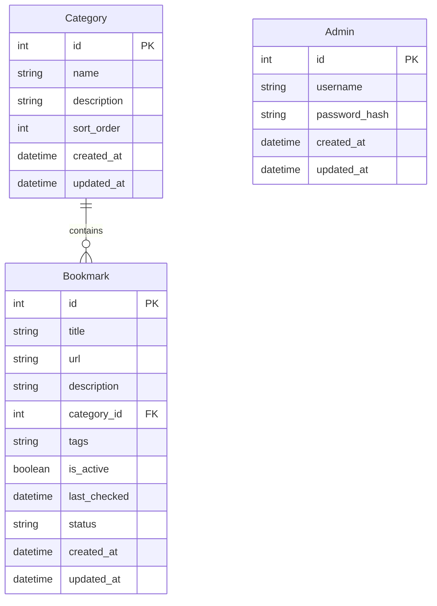

# 设计文档

## 概述

书签管理系统是一个基于Web的双角色应用程序，采用前后端分离架构。系统包含公开的书签展示前端和管理员后台，支持大量书签的有效管理和展示。

### 核心特性
- 响应式前端展示页面，支持分类浏览和搜索
- 管理员后台，支持书签的CRUD操作和批量管理
- 支持多种书签格式的导入导出
- 链接有效性检查和统计功能

## 架构

### 整体架构



### 技术栈选择

**前端技术（Cloudflare Pages）：**
- React 18 + TypeScript - 现代化用户界面
- Vite - 快速构建工具，完美支持Cloudflare Pages
- Tailwind CSS - 快速样式开发
- React Router - 客户端路由
- TanStack Query - 数据获取和缓存
- Cloudflare Web Analytics - 性能监控（免费）

**后端技术（Cloudflare Workers）：**
- Cloudflare Workers - 边缘计算平台
- Hono - 轻量级Web框架，专为Workers优化
- TypeScript - 类型安全
- Drizzle ORM - 轻量级ORM，完美支持D1
- Cloudflare D1 - 全球分布式SQLite数据库

**部署架构（完全免费）：**
- **前端**：Cloudflare Pages（无限带宽）
- **后端API**：Cloudflare Workers（100,000次请求/天）
- **数据库**：Cloudflare D1（100,000次读取/天，50,000次写入/天）
- **文件存储**：Cloudflare R2（10GB免费存储，用于导入文件临时处理）
- **CDN**：Cloudflare全球边缘网络（免费）
- **域名**：Cloudflare免费子域名（your-app.pages.dev）

**开发工具：**
- Vite - 前端构建工具
- Wrangler CLI - Cloudflare开发和部署工具
- ESLint + Prettier - 代码质量
- Miniflare - 本地Workers开发环境

## 组件和接口

### 前端组件架构



### 核心组件说明

**公开展示组件：**
- `HomePage` - 主页，显示所有分类
- `CategoryPage` - 分类页面，显示特定分类的书签
- `SearchComponent` - 搜索功能组件
- `BookmarkCard` - 书签卡片组件
- `CategoryCard` - 分类卡片组件

**管理后台组件：**
- `AdminDashboard` - 管理员仪表板
- `BookmarkManager` - 书签管理界面
- `CategoryManager` - 分类管理界面
- `ImportExport` - 导入导出功能
- `LinkChecker` - 链接检查工具

### API接口设计

**公开API（无需认证）：**
```typescript
// 获取所有分类
GET /api/categories
Response: Category[]

// 获取分类下的书签
GET /api/categories/:id/bookmarks?page=1&limit=20
Response: { bookmarks: Bookmark[], total: number, page: number }

// 搜索书签
GET /api/search?q=keyword&page=1&limit=20
Response: { bookmarks: Bookmark[], total: number, page: number }
```

**管理API（需要认证）：**
```typescript
// 书签管理
GET /api/admin/bookmarks
POST /api/admin/bookmarks
PUT /api/admin/bookmarks/:id
DELETE /api/admin/bookmarks/:id

// 分类管理
GET /api/admin/categories
POST /api/admin/categories
PUT /api/admin/categories/:id
DELETE /api/admin/categories/:id

// 导入导出
POST /api/admin/import
GET /api/admin/export?format=html|json|csv

// 链接检查
POST /api/admin/check-links
GET /api/admin/stats
```

## 数据模型

### 数据库设计



### 数据模型接口

```typescript
interface Category {
  id: number;
  name: string;
  description?: string;
  sortOrder: number;
  bookmarkCount?: number;
  createdAt: Date;
  updatedAt: Date;
}

interface Bookmark {
  id: number;
  title: string;
  url: string;
  description?: string;
  categoryId: number;
  category?: Category;
  tags: string[];
  isActive: boolean;
  lastChecked?: Date;
  status: 'active' | 'inactive' | 'error';
  createdAt: Date;
  updatedAt: Date;
}

interface Admin {
  id: number;
  username: string;
  createdAt: Date;
  updatedAt: Date;
}
```

## 错误处理

### 前端错误处理策略

1. **网络错误**
   - 显示友好的错误消息
   - 提供重试机制
   - 离线状态检测

2. **数据验证错误**
   - 实时表单验证
   - 清晰的错误提示
   - 字段级别的错误显示

3. **权限错误**
   - 自动重定向到登录页
   - 会话过期提醒

### 后端错误处理策略

1. **统一错误响应格式**
```typescript
interface ErrorResponse {
  success: false;
  error: {
    code: string;
    message: string;
    details?: any;
  };
}
```

2. **错误分类**
   - 400系列：客户端错误（验证失败、权限不足）
   - 500系列：服务器错误（数据库连接、外部服务）

3. **日志记录**
   - 结构化日志
   - 错误追踪
   - 性能监控

## 测试策略

### 前端测试

1. **单元测试**
   - 组件渲染测试
   - 工具函数测试
   - 使用Jest + React Testing Library

2. **集成测试**
   - API调用测试
   - 用户交互流程测试

3. **端到端测试**
   - 关键用户路径测试
   - 使用Playwright或Cypress

### 后端测试

1. **单元测试**
   - 业务逻辑测试
   - 数据模型测试
   - 使用Jest

2. **集成测试**
   - API端点测试
   - 数据库操作测试
   - 使用Supertest

3. **性能测试**
   - 负载测试
   - 数据库查询优化测试

### 测试数据管理

1. **测试数据库**
   - 独立的测试数据库
   - 测试前后数据清理

2. **Mock数据**
   - API响应模拟
   - 外部服务模拟

3. **测试覆盖率**
   - 目标：80%以上代码覆盖率
   - 关键业务逻辑100%覆盖

## 安全考虑

### 认证和授权

1. **管理员认证**
   - JWT令牌认证
   - 密码哈希存储（bcrypt）
   - 会话管理

2. **API安全**
   - 请求频率限制
   - CORS配置
   - 输入验证和清理

### 数据安全

1. **数据验证**
   - URL格式验证
   - XSS防护
   - SQL注入防护（通过ORM）

2. **文件上传安全**
   - 文件类型验证
   - 文件大小限制
   - 恶意文件检测

## 性能优化

### 前端优化

1. **代码分割**
   - 路由级别的懒加载
   - 组件级别的动态导入

2. **缓存策略**
   - React Query缓存
   - 浏览器缓存
   - CDN静态资源

3. **渲染优化**
   - 虚拟滚动（大量书签列表）
   - 图片懒加载
   - 防抖搜索

### 后端优化

1. **Workers优化**
   - 冷启动优化（Workers启动极快）
   - 边缘计算优势（全球分布）
   - 轻量级依赖（Hono框架）

2. **API优化**
   - 响应压缩
   - 分页实现
   - Cloudflare Cache API缓存策略

3. **数据库优化**
   - 索引优化（SQLite）
   - 查询优化（Drizzle ORM）
   - D1全球复制优势

## 部署架构详细说明

### Cloudflare全栈方案优势

**优点：**
- 完全免费且额度充足
- 全球边缘网络，性能优异
- 一体化部署（Pages + Workers + D1）
- Git集成，自动部署
- 国内访问相对更好

**适用场景：**
- 个人项目
- 全球用户访问
- 成本敏感项目
- 高性能要求

### 免费方案详细说明

**Cloudflare免费层额度：**
- **Pages**：无限带宽，500次构建/月
- **Workers**：100,000次请求/天
- **D1**：100,000次读取/天，50,000次写入/天，5GB存储
- **R2**：10GB存储，1000万次A类操作/月

**项目规模估算：**
- D1的5GB存储可支持数十万个书签
- 每天10万次请求对个人使用绰绰有余
- 完全满足书签管理项目需求

**性能优势：**
- 全球200+数据中心
- D1数据库全球复制
- 边缘计算，延迟极低
- 自动HTTPS和DDoS防护

### 环境配置

**开发环境：**
```bash
# 安装Wrangler CLI
npm install -g wrangler

# 本地开发
npm run dev
wrangler pages dev dist

# 本地Workers开发
wrangler dev
```

**生产环境变量：**
```env
# wrangler.toml配置
ADMIN_USERNAME=admin
ADMIN_PASSWORD_HASH=hashed_password
JWT_SECRET=your_jwt_secret
```

**部署命令：**
```bash
# 部署Pages
wrangler pages deploy dist

# 部署Workers
wrangler deploy

# 创建D1数据库
wrangler d1 create bookmark-db
```