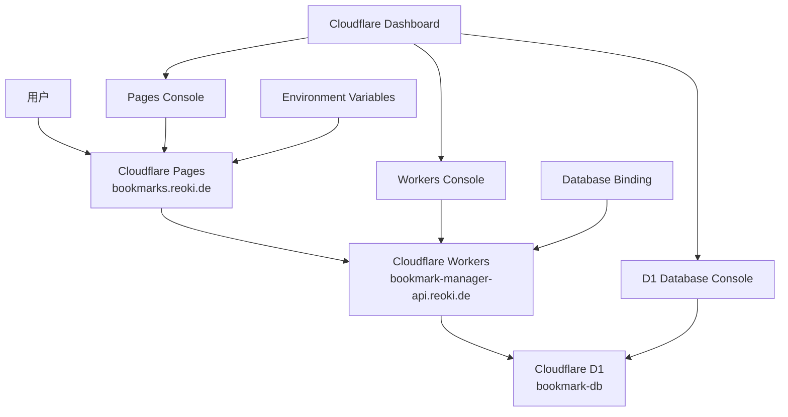

# 设计文档

## 概述

通过Cloudflare网页控制台完成书签管理系统的后端部署。前端已部署至 https://bookmarks.reoki.de/，后端将部署至 https://bookmark-manager-api.reoki.de/。本设计文档详细说明了通过网页界面创建D1数据库、部署Worker API以及配置系统集成的完整流程。

### 核心目标
- 通过网页控制台创建和配置D1数据库
- 部署功能完整的Worker API
- 建立前后端连接
- 验证系统完整性

## 架构

### 部署架构图



### 技术组件

**数据库层 (Cloudflare D1):**
- SQLite兼容的分布式数据库
- 全球边缘复制
- 通过网页控制台管理
- SQL查询界面

**API层 (Cloudflare Workers):**
- 边缘计算平台
- 支持TypeScript/JavaScript
- 内置CORS处理
- 自动HTTPS

**前端层 (Cloudflare Pages):**
- 静态站点托管
- 环境变量配置
- 自动部署

## 组件和接口

### D1数据库设计

**数据库结构:**
```sql
-- 分类表
CREATE TABLE categories (
    id INTEGER PRIMARY KEY AUTOINCREMENT,
    name TEXT NOT NULL UNIQUE,
    description TEXT,
    sort_order INTEGER DEFAULT 0,
    created_at TEXT DEFAULT CURRENT_TIMESTAMP,
    updated_at TEXT DEFAULT CURRENT_TIMESTAMP
);

-- 书签表
CREATE TABLE bookmarks (
    id INTEGER PRIMARY KEY AUTOINCREMENT,
    title TEXT NOT NULL,
    url TEXT NOT NULL,
    description TEXT,
    category_id INTEGER NOT NULL,
    tags TEXT, -- JSON格式存储
    is_active INTEGER DEFAULT 1,
    last_checked TEXT,
    status TEXT DEFAULT 'active',
    created_at TEXT DEFAULT CURRENT_TIMESTAMP,
    updated_at TEXT DEFAULT CURRENT_TIMESTAMP,
    FOREIGN KEY (category_id) REFERENCES categories(id)
);

-- 管理员表
CREATE TABLE admins (
    id INTEGER PRIMARY KEY AUTOINCREMENT,
    username TEXT NOT NULL UNIQUE,
    password_hash TEXT NOT NULL,
    created_at TEXT DEFAULT CURRENT_TIMESTAMP,
    updated_at TEXT DEFAULT CURRENT_TIMESTAMP
);
```

**索引设计:**
```sql
CREATE INDEX idx_bookmarks_category_id ON bookmarks(category_id);
CREATE INDEX idx_bookmarks_status ON bookmarks(status);
CREATE INDEX idx_bookmarks_created_at ON bookmarks(created_at);
```

### Worker API设计

**核心API端点:**
```typescript
// 健康检查
GET /health

// 公开API
GET /api/categories
GET /api/categories/:id/bookmarks
GET /api/search

// 管理API
POST /api/admin/login
GET /api/admin/stats
```

**Worker代码结构:**
```typescript
export interface Env {
  DB: D1Database;
  JWT_SECRET?: string;
}

export default {
  async fetch(request: Request, env: Env): Promise<Response> {
    // 路由处理逻辑
  }
}
```

### CORS配置

**跨域设置:**
```typescript
const corsHeaders = {
  'Access-Control-Allow-Origin': '*',
  'Access-Control-Allow-Methods': 'GET, POST, PUT, DELETE, OPTIONS',
  'Access-Control-Allow-Headers': 'Content-Type, Authorization',
};
```

## 数据模型

### 示例数据

**默认分类:**
```sql
INSERT INTO categories (name, description, sort_order) VALUES 
('开发工具', '编程和开发相关的工具和资源', 1),
('设计资源', 'UI/UX设计工具和素材网站', 2),
('学习资料', '在线课程和教程网站', 3);
```

**示例书签:**
```sql
INSERT INTO bookmarks (title, url, description, category_id, tags) VALUES 
('GitHub', 'https://github.com', '全球最大的代码托管平台', 1, '["代码托管", "开源", "协作"]'),
('Stack Overflow', 'https://stackoverflow.com', '程序员问答社区', 1, '["问答", "编程", "社区"]'),
('Figma', 'https://figma.com', '在线UI设计工具', 2, '["设计", "UI", "协作"]');
```

**默认管理员:**
```sql
-- 用户名: admin, 密码: admin123
INSERT INTO admins (username, password_hash) VALUES 
('admin', '$2b$10$rOzJqQZQXQXQXQXQXQXQXu7VqQZQXQXQXQXQXQXQXQXQXQXQXQXQXQ');
```

## 错误处理

### API错误响应格式

```typescript
interface ErrorResponse {
  success: false;
  error: {
    code: string;
    message: string;
  };
}
```

### 常见错误类型

1. **数据库连接错误**
   - 检查D1绑定配置
   - 验证数据库是否存在

2. **CORS错误**
   - 确认Worker CORS配置
   - 检查前端请求头

3. **环境变量错误**
   - 验证Pages环境变量设置
   - 确认API_BASE_URL格式

## 测试策略

### 部署验证步骤

1. **数据库测试**
   - 通过D1控制台执行查询
   - 验证表结构和数据

2. **API测试**
   - 访问健康检查端点
   - 测试各个API端点

3. **集成测试**
   - 前端连接后端测试
   - 端到端功能验证

### 测试用例

**健康检查测试:**
```bash
curl https://bookmark-manager-api.reoki.de/health
```

**分类API测试:**
```bash
curl https://bookmark-manager-api.reoki.de/api/categories
```

**搜索API测试:**
```bash
curl "https://bookmark-manager-api.reoki.de/api/search?q=github"
```

## 部署流程设计

### 阶段1: D1数据库创建

1. **创建数据库**
   - 导航到D1控制台
   - 创建名为"bookmark-db"的数据库
   - 记录数据库ID

2. **执行SQL脚本**
   - 使用Query界面执行建表语句
   - 插入示例数据
   - 验证数据完整性

### 阶段2: Worker部署

1. **创建Worker**
   - 导航到Workers控制台
   - 创建名为"bookmark-manager-api"的Worker
   - 配置自定义域名

2. **部署代码**
   - 通过Quick Edit上传Worker代码
   - 配置环境变量
   - 测试部署

### 阶段3: 数据库绑定

1. **配置绑定**
   - 在Worker设置中添加D1绑定
   - 变量名: DB
   - 选择bookmark-db数据库

2. **验证连接**
   - 重新部署Worker
   - 测试数据库连接

### 阶段4: 前端配置

1. **环境变量设置**
   - 在Pages项目中设置VITE_API_BASE
   - 值: https://bookmark-manager-api.reoki.de/api

2. **重新部署**
   - 触发Pages重新构建
   - 验证前端连接

### 阶段5: 系统验证

1. **功能测试**
   - 访问前端网站
   - 测试分类显示
   - 测试搜索功能

2. **管理功能测试**
   - 访问管理后台
   - 测试登录功能
   - 验证数据管理

## 监控和维护

### 性能监控

1. **Worker Analytics**
   - 请求量监控
   - 错误率跟踪
   - 响应时间分析

2. **D1 Metrics**
   - 查询性能
   - 存储使用量
   - 连接状态

### 日志记录

```typescript
// Worker中的日志记录
console.log('API Request:', {
  method: request.method,
  url: request.url,
  timestamp: new Date().toISOString()
});
```

### 备份策略

1. **数据导出**
   - 定期通过API导出数据
   - 保存为JSON格式
   - 存储到安全位置

2. **配置备份**
   - 记录Worker代码
   - 保存环境变量配置
   - 文档化部署步骤

## 安全考虑

### API安全

1. **输入验证**
   - URL格式验证
   - 参数长度限制
   - SQL注入防护

2. **访问控制**
   - 管理API认证
   - 请求频率限制
   - CORS策略

### 数据安全

1. **敏感信息保护**
   - 密码哈希存储
   - JWT密钥保护
   - 环境变量加密

2. **传输安全**
   - 强制HTTPS
   - 安全头设置
   - 证书管理

## 故障排除指南

### 常见问题及解决方案

1. **500内部服务器错误**
   - 检查D1数据库绑定
   - 验证Worker代码语法
   - 查看Worker日志

2. **CORS错误**
   - 确认CORS头设置
   - 检查预检请求处理
   - 验证域名配置

3. **数据库连接失败**
   - 确认绑定变量名称
   - 检查数据库状态
   - 验证SQL语句

4. **前端连接失败**
   - 检查环境变量设置
   - 确认API URL格式
   - 验证网络连接

### 调试工具

1. **Cloudflare Dashboard**
   - Worker日志查看
   - D1查询控制台
   - Analytics数据

2. **浏览器开发工具**
   - 网络请求监控
   - 控制台错误信息
   - 应用状态检查